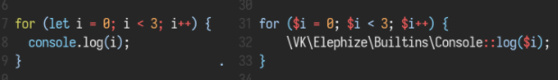
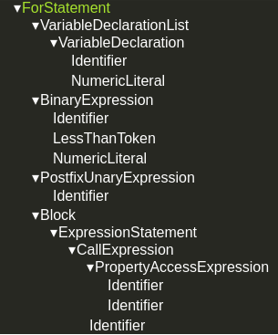
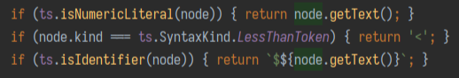
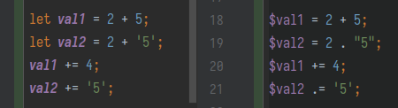

### Обработка базовых синтаксических конструкций

Базовые синтаксические конструкции языков совпадают по причине их си-подобности,
например:
- Литералы следует представлять такими же литералами в PHP
- Объявления и использования переменных также практически не меняются, за исключением 
добавления $ к именам.
- Условные конструкции и циклы также практически не меняются

Пример:



#### Как это реализуется на уровне обработки вершин AST?

Воспользуемся любым [бесплатным инструментом просмотра AST](https://ts-ast-viewer.com/),
и попробуем распарсить наш цикл. Увидим там нечто подобное:



Плохие новости: для каждого из типов ноды в списке мы будем вынуждены написать свой
обработчик. Хорошие новости: большая часть этих обработчиков тривиальна, например:



Заметим, что в примере мы используем встроенные функции typescript для определения 
того, что нода принадлежит к тому или иному типу. Для выражений такие функции есть, 
для примитивных токенов типа “меньше” - нет, поэтому для него мы явно проверяем 
свойство `kind`.

Рассмотрим реализацию обработчика `PostfixUnaryExpression`:
```typescript
export const tPostfixUnaryExpression: Handler = (node, context) => {
    const opMap = {
        [ts.SyntaxKind.MinusMinusToken]: '--',
        [ts.SyntaxKind.PlusPlusToken]: '++',
    };
    const operator = opMap[node.operator];
    const content = renderNode(node.operand, context);
    return `${content}${operator}`;
};
```

Здесь можно увидеть, как мы явным образом обрабатываем операторы `++` и `--`, но 
поскольку в качестве операнда могут быть не только идентификаторы, оставляем его 
обработку на функцию `renderNode`, которая сама выберет подходящий обработчик по
типу операнда.

Аналогичным образом реализуются и все остальные обработчики. Посмотрим отдельно на 
обработчик именно конструкции цикла for:

```typescript
export function tForStatement(node, context) {
    const [varInit, condition, incrementor] = renderNodes([node.initializer, node.condition, node.incrementor], context);
    const statement = renderNode(node.statement, context);
    return `for (${varInit}; ${condition}; ${incrementor}) ${statement}`;
}
```

Надо заметить, что этот обработчик сработает только для традиционной конструкции for -
для конструкций for-in и for-of у нас будут отдельные обработчики, в их случае очень
сподручно будет преобразовать конструкцию в foreach из мира php.

Отдельно можно рассмотреть имплементацию выражения `+`. Нюанс тут состоит в том, что
`+` в JS используется как для сложения чисел, так и для конкатенации строк, при этом
в php для конкатенации используется отдельный оператор `.` (точка).



Таким образом, мы не можем наивным образом затранспилировать бинарное выражение с 
оператором `+`, нам обязательно нужно обратиться к тайпчекеру и понять, с какими типами
мы имеем дело:

```typescript
export function tBinaryExpression(node, context) {
    if (node.operatorToken.kind === ts.SyntaxKind.PlusToken) {
        const typeLeft = context.checker.getTypeAtLocation(node.left);
        const typeRight = context.checker.getTypeAtLocation(node.right);
        if (
            typeLeft.isStringLiteral() ||
            typeRight.isStringLiteral() ||
            context.checker.typeToString(typeLeft, node.left, ts.TypeFormatFlags.None) === 'string' ||
            context.checker.typeToString(typeRight, node.right, ts.TypeFormatFlags.None) === 'string'
        ) {
            const leftExpr = renderNode(node, context);
            let operator = renderNode(node.operatorToken, context);
            const rightExpr = renderNode(node, context);
            return `${leftExpr} ${operator} ${rightExpr}`;
        }
    }
}
```

Подобный подход может использоваться и в прочих конструкциях, где JS ведет себя более
полиморфно, а PHP - менее, например при транспиляции вызовов функций стандартной
библиотеки, типа `.slice()` или `.includes()`, которые в случае строк должны быть 
переведены в выражения `substr()` или `(indexOf() !== false)` соответственно, а в
случае массивов - в вызовы `array_slice()` или `in_array()`.

Кстати, интересный момент можно найти в реализации функции `slice`: в JS она имеет
следующую сигнатуру:
```typescript
.slice(beginIndex[, endIndex])
```
Тогда как в PHP функции `substr` и `array_slice` имеют следующие сигнатуры:
```php
substr(string $string, int $offset, ?int $length = null)
array_slice(array $array, int $offset, ?int $length = null)
```

Т.е. В JS мы указываем индекс последнего элемента, до которого нужно взять кусок,
а в PHP - длину куска. Из-за этого факта приходится делать что-то подобное:

```php
public static function stringSlice($str, $start, $end = null) {
    if ($end !== null) {
        $ret = mb_substr($str, $start, abs($end - $start));
    } else {
        $ret = mb_substr($str, $start);
    }
    return $ret ? $ret : "";
}
```

Сам вызов `String.prorotype.slice()` мы соответственно транспилируем в вызов этой 
функции. Теоретически, мы могли бы сделать замену прямо на месте, но это может
вызвать некоторые сложности в тех случаях, когда `slice()` используется внутри
выражений, например внутри цепочки типа `str.slice(...).split(...).map(...)`.

Подобный подход с выносом нетривиальной логики в отдельные функции библиотеки 
транспилятора часто сильно упрощает жизнь, хотя, в теории, конечно может замедлить
выполнение кода.
