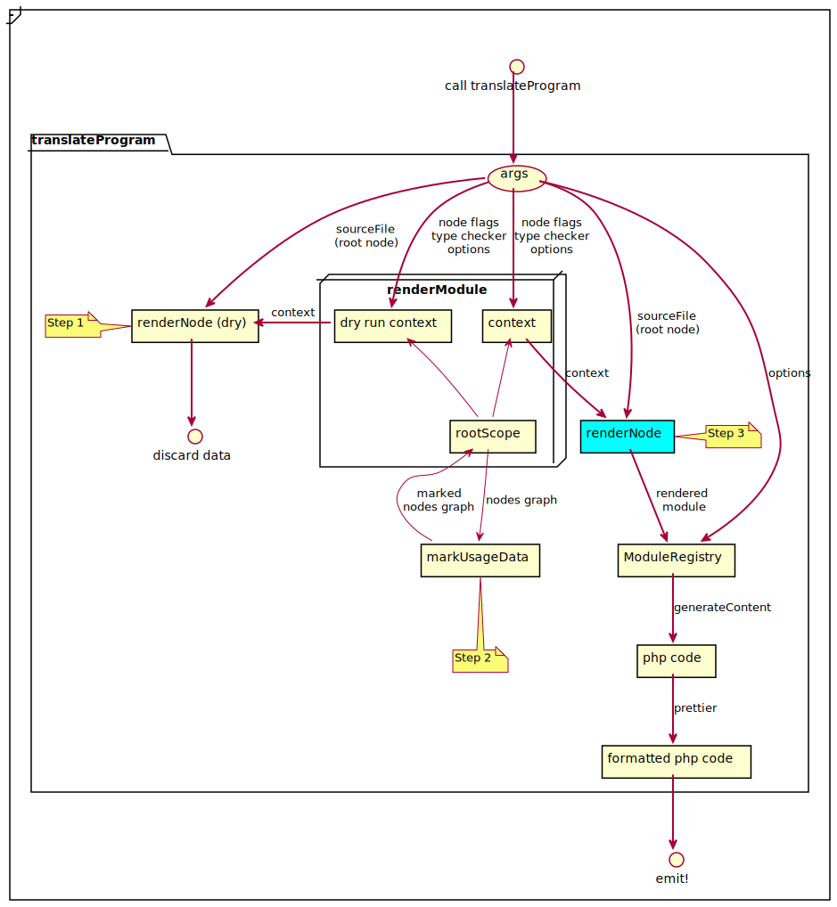

## Общие принципы построения библиотеки

#### 1. Typescript как основа

Вся библиотека построена как обвязка для компилятора typescript (tsc). Из библиотеки интенсивно используются парсер
и тайпчекер, а также структуры данных, порождаемые вместе с AST. Это означает, что:
- Заменить typescript другим парсером не представляется возможным, поскольку проще написать библиотеку заново.
- Для справки относительно парсера, AST и типов можно использовать любые источники, относящиеся к typescript, в том числе:
    - https://github.com/Microsoft/TypeScript/wiki/Using-the-Compiler-API
    - https://ts-ast-viewer.com/ или https://astexplorer.net/ для изучения AST
- Входные файлы должны быть правильными ts(x)-файлами, в ином случае не будет гарантий корректной транспиляции.

#### 2. Принцип ортогональности синтаксических конструкций

Архитектура построения компиляторов в целом и использование AST в частности позволяет использовать относительно независимые
обработчики различных синтаксических конструкций. В терминологии библиотеки elephize такие обработчики называются
**рендерерами** (renderer). Каждый рендерер (в идеальном мире) отвечает за свою и только за свою синтаксическую 
конструкцию. В реальном мире независимости рендереров удается достичь не всегда - часто смысл синтаксических конструкций
зависит от контекста. Тем не менее к такой независимости следует всячески стремиться в процессе разработки.

Отдельную категорию в составе elephize составляют рендереры стандартной библиотеки (stdlib renderers), которые 
отвечают за преобразование отдельных библиотечных вызовов (например, `.toString()` или `Array.prototype.map`).

#### 3. Дополнительные слои и подсистемы

Рендереры в процессе работы не только генерируют код, но и общаются с более высокоуровневыми слоями библиотеки, 
в частности:
- Слой поддержки модулей, отвечающий за:
    - Поддержку модульности в целом на основе инструкций import-export
    - Поддержку react-компонентов, enum-модулей и внешних модулей
    - Разрешение путей и раскладывание файлов по папкам и неймспейсам
- Слой специфической поддержки react, в частности - поддержки хуков и логики, позволяющей отличить компонент от обычной функции.
- Слой вывода типов, необходимый для:
    - Корректной генерации операторов и вызовов в случае неоднозначности (например, разница в генерации при обработке
      `.slice()` от строки и от массива)
    - Генерации типизированных phpdoc-комментариев
- Слой удаления неиспользуемого кода, необходимый для корректной очистки серверного кода после удаления из него клиентских
  обработчиков (например, onclick).
  
### От консольной команды до рендеринга конкретных конструкций

#### Внешний слой: CLI, опции и связка с tsc

Рассмотрим вкратце схему внешнего слоя:

Жирными стрелками обозначены основные потоки данных, состоящие по большей части из опций компилятора и транслятора.
Немного пояснений по компонентам схемы:

- [cli.ts](../../src/cli.ts): точка входа консольной утилиты. Именно она запускается при вызове elephize из командной
  строки. Здесь мы разбираем опции, переданные непосредственно в cli, добавляем к ним опции из конфигурационного файла,
  а потом - опции по умолчанию, в дальнейшем этот набор опций используется везде при конфигурировании поведения.
- [transpile.ts](../../src/ts2php/components/cli/transpile.ts): определяет режим работы (сборка или watch-режим), 
  генерирует bootstrap-файл (содержащий все php-файлы, полезно на случай отсутствия автозагрузки, хотя в общем случае
  рекомендуется лучше воспользоваться именно автозагрузкой через spl_register_autoload или аналогичные средства),
  а также копирует готовые файлы стандартной библиотеки elephize по месту назначения.
- [translateCode](../../src/ts2php/components/codegen/programUtils/translateProgram.ts)[(andWatch)](../../src/ts2php/components/codegen/programUtils/watchProgramFactory.ts): 
  функции, делающие одно и то же, но для разных режимов работы библиотеки. Суть в том, чтобы создать __программу__ 
  (т.е. экземпляр объекта Program из пакета typescript) и передать ее на следующий слой. Помимо самой программы также
  создается и передается ниже объект [__NodeFlagsStore__](../../src/ts2php/components/codegen/nodeFlagStore.ts), 
  единый для всего проекта, по сути являющийся подобием контекста проекта. В типе NodeFlags есть подробные комментарии 
  к каждому полю.
  
#### Промежуточный слой: поддержка модульности, [UCE](unused-code-elimination.md), контексты и области видимости

На предыдущем слое голубым цветом был помечен компонент 
[translateProgram](../../src/ts2php/components/codegen/programUtils/translateProgram.ts) - это обычная функция, а по
сути своей это точка входа на промежуточный слой. Рассмотрим то, что происходит внутри этой функции.

- Всё начинается с функции [renderModule](../../src/ts2php/components/codegen/renderModule.ts), в нее передаются
  NodeFlagsStore, экземпляр объекта TypeChecker из пакета typescript и набор опций, пришедший из внешнего слоя.
- Внутри функции создается объект глобальной области видимости модуля - 
  [__rootScope__](../../src/ts2php/components/unusedCodeElimination/usageGraph/scope.ts), а также два объекта 
  [контекста](../../src/ts2php/components/context.ts) - для двух проходов, о которых далее. Изначально объекты
  контекстов идентичны и пусты.
- Для того, чтобы собрать начальные данные относительно используемых переменных, а потом удалить неиспользуемые,
  в библиотеке используется двойной проход по AST (корень которого приходит в функцию как корневая нода файла - 
  SourceFile). Процесс состоит из трех шагов: 
  - На первом проходе (первый вызов функции [renderNode](../../src/ts2php/components/codegen/renderNodes.ts), 
    так называемый dry run) мы собираем информацию о том, какие идентификаторы у нас в принципе есть и как они
    связаны друг с другом, т.е. строим [граф связности](../../src/ts2php/components/unusedCodeElimination/usageGraph/node.ts).
    Результат рендеринга кода с первого этапа отбрасывается.
  - Между проходами на собранном графе связности (который доступен через rootScope) мы вызываем функцию 
    обхода в ширину, которая обходит граф и помечает все достижимые вершины. 
  - На втором проходе (второй вызов функции renderNode, помечен голубым) у нас уже есть информация о том,
    используется или нет конкретный идентификатор, соответственно при генерации кода мы можем принять 
    решение о том, рендерить ли этот идентификатор и сопутствующие ему синтаксические конструкции.
- Результат рендеринга кода со второго этапа поступает в компонент 
  [ModuleRegistry](../../src/ts2php/components/cjsModules/moduleRegistry.ts), где регистрируется
  в качестве одного или нескольких php-модулей. Дополнительные модули могут появиться в случае использования
  [react-компонентов](../../src/ts2php/components/cjsModules/reactModule.ts) и 
  [enum-конструкций](src/ts2php/components/cjsModules/enumModule.ts), т.к. для их корректного представления
  на стороне сервера потребовалось использовать полноценные классы.
- После того как все исходные файлы были преобразованы, в объекте ModuleRegistry вызывается метод generateContent,
  который собирает готовый текст php-файла из выражений, полученных при транспиляции. Далее этот текст передается
  в prettier for php, который обеспечивает консистентное форматирование кода. Далее текст передается в предыдущий
  слой для записи в файлы.
  
#### Внутренний слой: рендереры, поддержка стандартной библиотеки

Функция [renderNode](../../src/ts2php/components/codegen/renderNodes.ts) принимает конкретный узел AST и пытается
его корректно перевести в соответствующее строковое представление на языке php. Внутри содержится большой
switch-case по типам синтаксических конструкций, каждая из которых отдается на реализацию конкретному рендереру.

Среди [множества рендереров](../../src/ts2php/renderers) следует упомянуть некоторые, имеющие особый интерес:
- Функциональные рендереры - для узлов FunctionDeclaration, FunctionExpression и ArrowFunction - имеют много общего
  кода, в частности, отвечающего за поддержку [замыканий и областей видимости](../../src/ts2php/components/functionScope.ts),
  а также за функциональные [react-компоненты](../../src/ts2php/components/react/reactComponents.ts).
- Рендерер вызова CallExpression - является помимо всего прочего точкой входа для рендереров функций
  поддержки [стандартной библиотеки](../../src/ts2php/renderers/stdlib/index.ts). По сути все stdlib-рендереры
  являются частным случаем CallExpression. Кроме того, именно здесь происходит обработки функций 
  [react-хуков](../../src/ts2php/components/react/reactHooks.ts).
- Рендерер EnumDeclaration, порождающий отдельные php-классы для каждой enum-конструкции.
