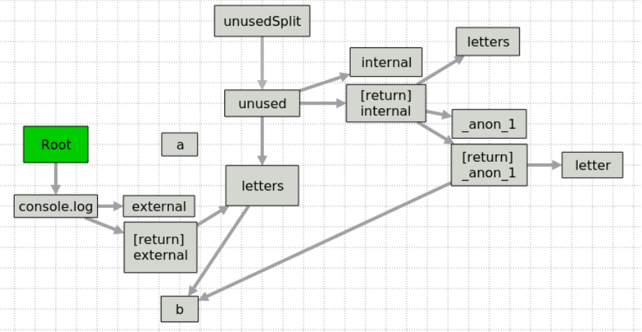
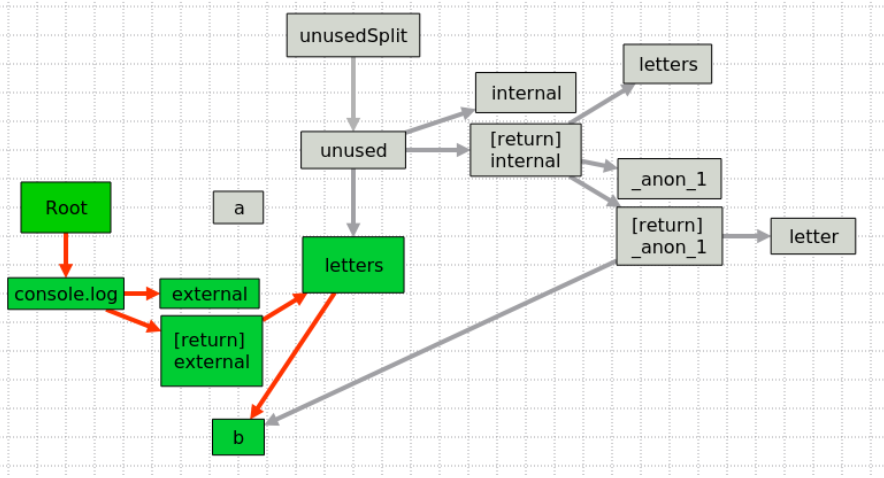
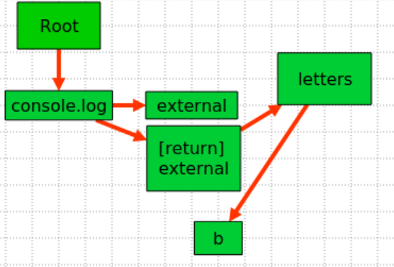

### Неиспользуемый код и как с ним бороться

В некоторых случаях у нас может появиться некоторый код, который на сервере не имеет 
смысла. Например, вы написали сложный обработчик `onClick` в реакт-компоненте, но
очевидно, что на сервере у нас никакой интерактивности нет, следовательно:
- Не нужно присвоение обработчика
- Не нужен его исходный код
- Не нужны все зависимости (переменные, функции), от которых зависит обработчик
- Не нужны все зависимости этих зависимостей… и так далее

Дело усложняется тем, что некоторые переменные и функции могут все же использоваться
для начального рендеринга, и тогда их удалять нельзя. Что делать в таком случае?

Очевидно, что нужно составить граф вызовов и использований идентификаторов. Для начала
этот граф нужно, собственно, составить. И это можно сделать на основе уже имеющегося 
механизма обработки замыканий:
- Всегда существует корневой узел, соответствующий области видимости модуля.
- Объявление функции (в том числе анонимной) или переменной (в том числе параметра 
  функции) будет порождать узел графа
- Узел будет автоматически привязываться ребром к вышележащей области видимости.

Далее нужно понять, какие переменные и функции мы действительно используем. В каком
случае идентификатор считается используемым?
- Если это переменная - все просто, любое использование этой переменной в любом 
  контексте должно выставлять идентификатору переменной флаг used. Если это доступ 
  к свойству объекта - используемым помечается самый верхний идентификатор в
  `PropertyAccessExpression`
- Если это функция - все становится интереснее. Во-первых, мы должны пометить сам 
  идентификатор функции как **used**. Во-вторых, все аргументы функции тоже должны быть
  помечены как **used**.

С такой схемой возникает ряд вопросов:
- Но что если переменная только объявлена, но больше нигде не используется?
- Но что если у нас объявлена функция, которая передается в качестве коллбэка 
  например в обработчик `onClick`? Тогда и сама функция, и все ее аргументы, не
  должны помечаться как **used**.

Вопрос серьезный и решается он привязкой признака используемости возвращаемого значения
к тому контексту, в котором он используется. При этом когда мы парсим и обрабатываем
саму функцию, нам нужно где-то хранить список переменных, которые ей нужны для 
корректного исполнения и выдачи результата.

На этот случай приходится внедрять фиктивные узлы - назовем их узлами возврата. Узел 
возврата создается автоматически для каждой функции, и все переменные, участвующие в
любой конструкции return привязываются к этому узлу, как зависимые.

Таким образом мы приходим к схеме, определяющей используемость переменных на основе 
того, к каким другим конструкциям они привязаны. Если вся конструкция не используется,
переменные также можно отбросить.

Другими словами, поначалу мы строим граф вообще всех переменных и функций. Каждая 
функция и переменная ребром привязана к своему контексту, например в выражениях типа
`const a = b + c`. Мы должны сделать переменные `b` и `c` зависимыми от переменной `a`,
т.е. провести однонаправленное ребро от `a` к `b` и `c`.

Вторым этапом у нас идет обход графа начиная от корневой вершины. Каждый узел,
попавший в обход, помечается как используемый.

Третьим этапом уже идет непосредственно кодогенерация - и те выражения, которые не
были помечены при обходе, мы вправе просто отбросить.

Звучит просто, но на деле возникает масса нюансов. Например, одним из нюансов будет
разница между контекстом определения функции (это там где мы определяем попадающие
в замыкание переменные) и контекстом ее вызова - ведь мы можем функцию передать в 
произвольное количество мест, как используемых, так и потенциально неиспользуемых. 
Здесь нам опять помогут наши фиктивные узлы возврата, которые можно свободно делать
зависимыми от того контекста (переменной или функции), которые используют возвращаемое
значение нашей функции.

Рассмотрим процедуру на простом примере.
```typescript
const a = 'test';
const b = 'used';

const internal = (letters: string[]): string => {
    return letters.map((letter) => '1' + b + letter).join();
};

function external() {
    const letters = b.split('');
    
    const unused = internal(letters);
    const unusedSplit = unused.split('');
    
    return letters;
}

console.log(external());
```
Допустим у нас есть такой код. Какой граф мы получим на первом этапе?



Теперь запускаем обход направленного графа начиная с корневого узла…


Получаем следующую картину из используемых узлов



И наконец отбрасываем лишнее:



Граф значительно упростился, и код на выходе из-за этого получится также гораздо
короче, и что самое главное - в нем не будет ничего лишнего.

Заметим, что в случае, если функция передается в качестве коллбэка в другую функцию
(например, в `map`), ее узел возврата будет присоединен к тому же выражению, что и 
идентификатор функции.

### Чуть подробнее про функции и области видимости с точки зрения графа используемых элементов

Поскольку в javascript объявления функций могут содержать другие объявления функций, но при этом действуют правила
доступа согласно __областям видимости__ (scope), этот факт также нужно учесть в модели данных:
- По умолчанию и изначально мы работаем в области видимости текущего модуля (module scope).
- Объявление функции порождает новую область видимости.
- Внутри области видимости существует список объявленных переменных и функций. Также можно достучаться до списков
  объявленных идентификаторов в верхних областях.

Ребро в графе использований порождается в том случае, если для получения значения переменной или выполнения функции
требуется значение из другой переменной или функции в текущей или одной из верхних областей видимости.

Нужно определить четкий критерий того, используется ли данная переменная или функция. Для этого введем понятие
особой глобальной __терминальной вершины__ (обозначим ее аббревиатурой GTN - global terminal node) на уровне
модуля со следующими свойствами:
- GTN является единственной, в es-модуле не может быть двух GTN.
- Если от GTN до некоторой вершины X существует ребро, значит объявление, соответствующее вершине X, используется в коде.
- Ребра из GTN должны порождаться к тем вершинам, которые передают свое значение в следующие конструкции:
  - export (function/const)
  - console.log()
  - иные (библиотечные) средства вывода или передачи результата.
  - ... список может быть неполон.

Аналогичным образом введем понятие __локальной терминальной вершины__ (LTN - local terminal node), со следующими свойствами:
- LTN определяется на уровне объявления функции. У функции может быть одна и только одна LTN.
- Не может быть двух функций с одинаковыми LTN.
- Если от LTN до некоторой вершины X существует ребро, значит объявление, соответствующее вершине X, используется
  в коде функции и может быть удалено только вместе со всей функцией.

Когда в коде происходит вызов функции, создается вершина, соответствующая этому вызову. При этом важен тот факт, что
переменные или функции, которые используют результат вычисления функции, должны из соответсвующих вершин породить
ребра не только к вершине объявления функции, но и __к ее локальной терминальной вершине__. Это делается как раз
для того, чтобы понимать сценарий использования функции и потенциальную возможность удаления всей функции или
только некоторых из ее выражений.

В js допустим сценарий, когда объявление происходит ПОСЛЕ использования (т.е. hoisting). Для поддержки этого
сценария вводим два типа вершин в графе:
- BoundNode - уже связанная с объявлением вершина, готовая к использованию.
- BindPendingNode - может быть создана только при регистрации использования до объявления. Если вершина была использована,
  но не была объявлена до конца файла - это явная ошибка компиляции. Если же объявление найдено, в этот момент вершина преобразуется
  к предыдущему типу и работает соответственно.

[Далее: Обзор архитектуры](./basic-architecture.md)